# 🤖 AI Home Design Copilot

This web application acts as your creative partner, using AI to take your home design ideas from a simple concept to a full-fledged visual gallery. Generate blueprints, create architectural renders, and design interiors, all through a simple, step-by-step process.

---

## ✨ Features

-   **Blueprint Generation**: Describe your ideal home—plot size, style, number of floors—and generate a 2D architectural blueprint.
-   **Iterative Revision**: Modify your blueprint with natural language. Ask for a bigger kitchen or an extra window, and the AI will revise the plan.
-   **Architectural Visualization**: Automatically generate clean, unfurnished architectural views of every room from your approved blueprint.
-   **3D Isometric View**: Get a 3D isometric render of the entire house exterior for a holistic view.
-   **AI-Powered Interior Design**: Choose an interior design style (e.g., "Modern," "Minimalist," "Bohemian") and let the AI furnish and decorate each room.
-   **Final Gallery**: View, and save all your generated images—from blueprint to fully designed interiors—in a final gallery.
-   **Light/Dark Mode**: A sleek interface that adapts to your preferred theme.

---

## 💎 Gemini Integration

This application is powered by the Google Gemini 2.5 Flash model, which is central to every step of the design process. Here’s how it’s used:

-   **Text-to-Image Generation**: Gemini creates the initial 2D blueprint from a detailed text prompt that outlines architectural standards and user requirements.
-   **Image-to-Image Editing**: The blueprint revision feature works by feeding the existing blueprint image back to Gemini along with a text prompt for the requested changes.
-   **Structured Data Generation**: Before creating architectural views, the application asks Gemini to analyze the blueprint and return a JSON list of all the rooms, which then drives the rest of the workflow.
-   **Creative Image Generation**: Gemini generates both the empty architectural room views and the final, fully-furnished interior designs based on creative prompts and selected styles. The isometric view of the house is also generated this way.

---

## 🚀 Getting Started

To run this application locally, you will need Node.js installed.

1.  **Clone the repository:**
    ```bash
    git clone <your-repo-url>
    cd <repo-folder>
    ```

2.  **Install dependencies:**
    ```bash
    npm install
    ```

3.  **Set up your environment variables:**
    *   Create a new file in the root of the project named `.env.local`.
    *   Open the `.env.local` file and add your Google Gemini API key like this:
        ```
        VITE_API_KEY=AIzaSy...your...key...
        ```

4.  **Run the application:**
    ```bash
    npm run dev
    ```
    The application will be available at `http://localhost:5173`.

---

## 📊 Workflow

This diagram illustrates the user's journey from initial idea to final design gallery.

```mermaid
graph TD
    subgraph "1. Blueprint Phase"
        A[🏠 Start on Home Page] --> B(📝 Enter Blueprint Options);
        B --> C{🤖 Generate Blueprint};
        C --> D{🔍 Review Blueprint};
        D -- Revise --> E(✍️ Provide Revision Text);
        E --> C;
        D -- Approve --> F(👍 Blueprint Approved);
    end

    subgraph "2. Visualization Phase"
        F --> G{🖼️ Generate Architectural Views};
        G --> H{🎨 Generate Interior Designs};
    end

    subgraph "3. Final Output"
        H --> I[🏆 View Final Design Gallery];
    end
```



---

## 🛠️ Technologies Used

-   **[React](https://reactjs.org/)**: ⚛️ For building the user interface.
-   **[TypeScript](https://www.typescriptlang.org/)**: 🔷 For type-safe JavaScript.
-   **[Vite](https://vitejs.dev/)**: ⚡ As the development server and build tool.
-   **[Tailwind CSS](https://tailwindcss.com/)**: 🎨 For styling the application.
-   **[Google Gemini API](https://ai.google.dev/)**: 🧠 As the core AI model for all generation tasks.

---

## 📁 Project Structure

Here is an overview of the key files in the project:

```
.
├── 📜 App.tsx                # Main application component, manages state and workflow
├── 🎨 index.css              # Global styles (via Tailwind CSS)
├── 🚀 index.tsx              # Main entry point for the React app
├── 📁 components/
│   ├── 📄 pages.tsx         # Contains the UI for each page/step in the workflow
│   └── 📄 ui.tsx            # Contains reusable UI elements like headers and spinners
├── 📁 services/
│   └── 🤖 geminiService.ts  # Handles all communication with the Google Gemini API
├── 🔑 .env.local             # Environment variables (API key) - not version controlled
└── 📦 package.json            # Project dependencies and scripts
```
---
